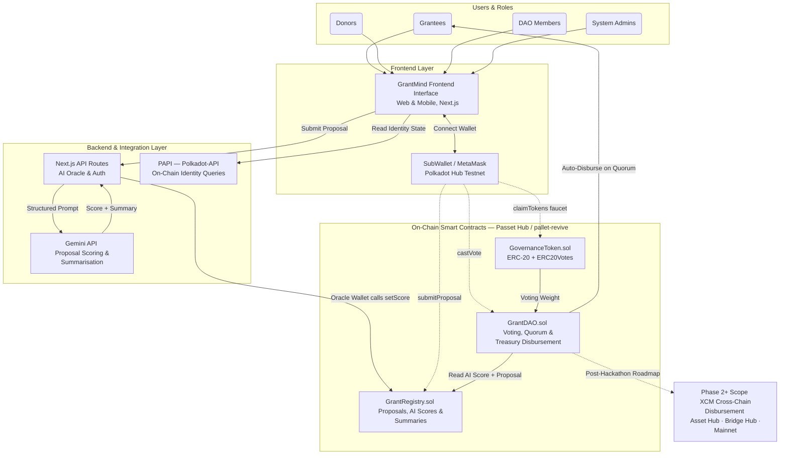

```mermaid
flowchart TD
    %% Actors
    subgraph Actors [Users & Roles]
        direction LR
        U(Grantees)
        D(Donors)
        M(DAO Members)
        A(System Admins)
    end

    %% Frontend Layer
    subgraph Frontend [Frontend Layer]
        UI[GrantMind Frontend Interface <br/> Web & Mobile, Next.js]
        W[SubWallet / MetaMask <br/> Polkadot Hub Testnet]
    end

    %% Backend & APIs
    subgraph Backend [Backend & Integration Layer]
        API[Next.js API Routes <br/> AI Oracle & Auth]
        Gemini[Gemini API <br/> Proposal Scoring & Summarisation]
        PAPI[PAPI — Polkadot-API <br/> On-Chain Identity Queries]
    end

    %% Smart Contracts Layer
    subgraph Contracts [On-Chain Smart Contracts — Passet Hub / pallet-revive]
        Token[GovernanceToken.sol <br/> ERC-20 + ERC20Votes]
        Registry[GrantRegistry.sol <br/> Proposals, AI Scores & Summaries]
        DAO[GrantDAO.sol <br/> Voting, Quorum & Treasury Disbursement]
    end

    %% Actor to Frontend
    U & D & M & A --> UI
    UI <-->|Connect Wallet| W

    %% Frontend to Backend
    UI -->|Submit Proposal| API
    UI -->|Read Identity State| PAPI

    %% AI Scoring Flow — core innovation path
    API -->|Structured Prompt| Gemini
    Gemini -->|Score + Summary| API
    API -->|Oracle Wallet calls setScore| Registry

    %% Direct Wallet Interactions
    W -.->|submitProposal| Registry
    W -.->|castVote| DAO
    W -.->|claimTokens faucet| Token

    %% On-Chain Contract Interactions
    Token -->|Voting Weight| DAO
    DAO -->|Read AI Score + Proposal| Registry
    DAO -->|Auto-Disburse on Quorum| U

    %% Future Scope Note
    FutureScope[Phase 2+ Scope <br/> XCM Cross-Chain Disbursement <br/> Asset Hub · Bridge Hub · Mainnet]
    DAO -.->|Post-Hackathon Roadmap| FutureScope
```