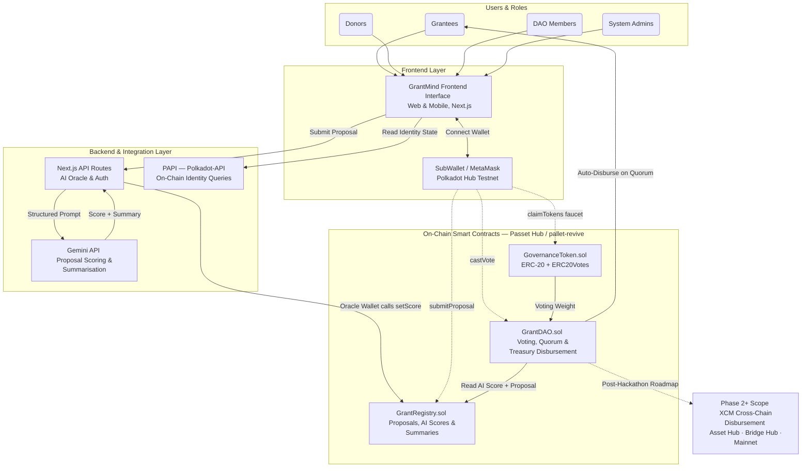

# GrantMind — Technical Architecture

> AI-Curated DAO Grant Allocator on Polkadot Hub  
> Polkadot Solidity Hackathon 2026 — EVM Smart Contract Track  
> Deployment Target: Passet Hub Testnet · Chain ID `420420417`

---

## Table of Contents

1. [System Overview](#1-system-overview)
2. [Architecture Diagram](#2-architecture-diagram)
3. [Layer Breakdown](#3-layer-breakdown)
   - 3.1 [Actor Roles](#31-actor-roles)
   - 3.2 [Frontend Layer](#32-frontend-layer)
   - 3.3 [Backend & Integration Layer](#33-backend--integration-layer)
   - 3.4 [On-Chain Smart Contract Layer](#34-on-chain-smart-contract-layer)
4. [Core Data Flows](#4-core-data-flows)
   - 4.1 [Proposal Submission Flow](#41-proposal-submission-flow)
   - 4.2 [AI Scoring Flow](#42-ai-scoring-flow)
   - 4.3 [Voting & Disbursement Flow](#43-voting--disbursement-flow)
5. [Smart Contract Specifications](#5-smart-contract-specifications)
   - 5.1 [GovernanceToken.sol](#51-governancetokensol)
   - 5.2 [GrantRegistry.sol](#52-grantregistrysol)
   - 5.3 [GrantDAO.sol](#53-grantdaosol)
6. [Backend Oracle Design](#6-backend-oracle-design)
7. [Frontend Architecture](#7-frontend-architecture)
8. [Security Considerations](#8-security-considerations)
9. [Deployment Architecture](#9-deployment-architecture)
10. [Future Scope](#10-future-scope)

---

## 1. System Overview

GrantMind is a three-stage decentralized grant allocation platform. Proposals flow through submission, AI analysis, and community governance — with every material state transition recorded on-chain.

The architecture is composed of four layers: a **Next.js frontend**, a **Next.js API backend acting as an AI oracle**, **three Solidity smart contracts** deployed on Passet Hub via pallet-revive (REVM), and **Polkadot-API (PAPI)** for native Polkadot ecosystem queries.

### Design Principles

- **Separation of concerns** — each smart contract owns exactly one domain of responsibility.
- **Oracle transparency** — AI scores are written on-chain and are permanently auditable once recorded.
- **No manual treasury intervention** — fund disbursement is fully automated by the `GrantDAO` contract upon quorum.
- **Safety-first token handling** — all ERC-20 interactions use `SafeERC20` from OpenZeppelin.
- **Access control over ownership** — `AccessControl` with role-based permissions is preferred over `Ownable` for any permissioned write operation.

---

## 2. Architecture Diagram



---

## 3. Layer Breakdown

### 3.1 Actor Roles

| Role | Description | Primary Actions |
|---|---|---|
| **Grantees** | Wallet holders seeking funding | Submit proposals, receive disbursements |
| **Donors** | Wallets funding the treasury | Deposit PAS/tokens to `GrantDAO` treasury |
| **DAO Members** | Governance token holders | Cast weighted votes on proposals |
| **System Admins** | Deployer / oracle operator | Deploy contracts, rotate oracle role, manage quorum params |

All actors interact through the frontend interface. Wallet-connected interactions (votes, submissions, faucet claims) are signed client-side and submitted directly to the chain via Wagmi. Backend interactions (AI scoring) are server-side only.

---

### 3.2 Frontend Layer

**Technology:** Next.js 14 (App Router) · Wagmi v2 · Viem · TailwindCSS

The frontend is a full-stack Next.js application. UI components are client-side React; blockchain interaction is handled via Wagmi hooks. The backend AI oracle runs as Next.js API Routes in the same project, keeping deployment simple (single Vercel project).

**Key UI surfaces:**

| Surface | Purpose |
|---|---|
| Proposal Submission Form | Collects title, description, requested amount, recipient address, supporting links |
| AI Leaderboard | Displays all proposals ranked by Gemini score (read from `GrantRegistry`) |
| Proposal Detail Page | Full AI summary, score breakdown, vote count, proposer address |
| Voting Interface | Connected wallets cast token-weighted votes via `GrantDAO.vote()` |
| Token Faucet | Demo-mode token claim via `GovernanceToken.faucet()` |

**Wallet support:** MetaMask (secp256k1 — works directly with Passet Hub EVM RPC) and SubWallet (Polkadot-native — requires account mapping for EVM interactions).

---

### 3.3 Backend & Integration Layer

**Technology:** Next.js API Routes · Google Gemini API · Polkadot-API (PAPI) · Viem WalletClient

The backend has three distinct responsibilities:

#### AI Oracle (`/api/score`)

Receives proposal data from the frontend, constructs a structured prompt for Gemini, parses the response, and writes the result on-chain via the oracle wallet. This is the core innovation pathway of GrantMind.

The oracle wallet is a dedicated server-side wallet whose private key is stored in `.env.local` as `ORACLE_PRIVATE_KEY`. It holds the `ORACLE_ROLE` on `GrantRegistry` and is the only address authorised to call `setScore()`.

#### Identity Resolution (PAPI)

PAPI is used to query the Polkadot identity pallet for on-chain identity state. At MVP, this surfaces verified identity badges alongside proposer addresses in the frontend. Post-hackathon, this will be used to gate proposal submission to verified identities.

PAPI connects to the native Substrate WebSocket endpoint (distinct from the EVM-compatible RPC used by Wagmi/Viem). Both connections run simultaneously in the application.

#### Environment Variables

```
GEMINI_API_KEY             # Google AI Studio API key — server-side only
ORACLE_PRIVATE_KEY         # Oracle wallet private key — server-side only, NEVER prefix with NEXT_PUBLIC_
NEXT_PUBLIC_CHAIN_ID       # 420420417
NEXT_PUBLIC_RPC_URL        # https://testnet-passet-hub-eth-rpc.polkadot.io
```

---

### 3.4 On-Chain Smart Contract Layer

**Technology:** Solidity · foundry-polkadot · OpenZeppelin v5 · pallet-revive (REVM runtime) · Passet Hub Testnet

Three contracts, each with a single domain of responsibility. Inter-contract dependencies flow in one direction only: `GrantDAO` reads from both `GovernanceToken` and `GrantRegistry`; neither `GovernanceToken` nor `GrantRegistry` calls back into `GrantDAO`.

```
GovernanceToken  ──(voting weight)──►  GrantDAO
GrantRegistry    ──(proposal data)──►  GrantDAO
GrantDAO         ──(disbursement)───►  Grantee wallet
Backend Oracle   ──(setScore)───────►  GrantRegistry
```

---

## 4. Core Data Flows

### 4.1 Proposal Submission Flow

```
Grantee fills form
    │
    ▼
Frontend validates inputs (client-side)
    │
    ▼
Wagmi: wallet signs and broadcasts tx
    │
    ▼
GrantRegistry.submitProposal(title, description, amount, recipient, links)
    │  emits: ProposalSubmitted(proposalId, proposer, timestamp)
    ▼
Proposal stored on-chain (score = 0, scored = false)
    │
    ▼
Frontend detects ProposalSubmitted event
    │
    ▼
Frontend calls POST /api/score with proposal data
    │
    ▼ (continues in AI Scoring Flow)
```

**Key design decision:** `submitProposal()` writes the proposal to chain first, before AI scoring. This means the proposal is always on-chain regardless of whether Gemini scoring succeeds. The `scored` boolean flag on each proposal struct distinguishes scored from pending proposals.

---

### 4.2 AI Scoring Flow

```
POST /api/score { proposalId, title, description, amount, links }
    │
    ▼
Backend constructs structured Gemini prompt
(innovation, technical feasibility, ecosystem alignment, team credibility)
    │
    ▼
Gemini API returns: { score: number, summary: string }
    │
    ├── on success ──►  Viem WalletClient (oracle wallet)
    │                       │
    │                       ▼
    │                   GrantRegistry.setScore(proposalId, score, summary)
    │                       │  emits: ProposalScored(proposalId, score)
    │                       ▼
    │                   Proposal updated on-chain (scored = true)
    │
    └── on failure ──►  Return 503, leave proposal in pending state
                        (score = 0, scored = false)
                        Frontend shows "Awaiting AI Score" badge
```

**Error handling:** A Gemini failure must never write a `score = 0` to the chain as if scoring succeeded. The `scored` flag is the source of truth. A pending proposal can be retried by the oracle; a retry endpoint should be accessible to `DEFAULT_ADMIN_ROLE` holders.

---

### 4.3 Voting & Disbursement Flow

```
DAO Member views leaderboard (ranked by AI score)
    │
    ▼
Member selects proposal, reviews AI summary
    │
    ▼
Wagmi: wallet signs GrantDAO.vote(proposalId)
    │
    ▼
GrantDAO checks:
  ├── GovernanceToken.balanceOf(voter) > 0
  ├── proposal is in ACTIVE state
  └── voter has not already voted on this proposal
    │
    ▼
Vote weight (token balance) added to proposal.voteCount
    │  emits: VoteCast(proposalId, voter, weight)
    │
    ├── if voteCount < quorumThreshold ──► no further action
    │
    └── if voteCount >= quorumThreshold
            │
            ▼
        Quorum reached — disbursement triggered automatically
            │
            ▼
        GrantDAO transfers proposal.amount to proposal.recipient
            │  emits: ProposalExecuted(proposalId, recipient, amount)
            ▼
        Proposal state set to EXECUTED
```

**No manual execution step.** Quorum check and disbursement happen atomically within `vote()`. There is no separate `execute()` call required. This is intentional — it removes an administrative bottleneck and makes the system fully trustless once a proposal reaches quorum.

---

## 5. Smart Contract Specifications

### 5.1 GovernanceToken.sol

**Inherits:** `ERC20`, `ERC20Votes` (OpenZeppelin v5), `AccessControl`

**Purpose:** Governance token whose balance determines voting weight in `GrantDAO`. During the hackathon demo, a public faucet function allows any wallet to claim tokens without a purchase flow.

**Key state:**

| Variable | Type | Description |
|---|---|---|
| `FAUCET_AMOUNT` | `uint256` | Fixed token amount dispensed per faucet call |
| `faucetCooldown` | `mapping(address => uint256)` | Timestamp of last faucet claim per address |

**Key functions:**

| Function | Access | Description |
|---|---|---|
| `faucet()` | Public | Mints `FAUCET_AMOUNT` tokens to caller; enforces cooldown period |
| `mint(address, uint256)` | `MINTER_ROLE` | Admin mint for initial distribution |

**Design notes:**
- Use `ERC20Votes` (not plain `ERC20`) so that vote weight snapshots are available. `GrantDAO` should read `getPastVotes()` at the proposal's creation block to prevent flashloan-style vote manipulation.
- The faucet cooldown prevents a single address from draining the demo allocation. A reasonable cooldown for hackathon purposes is 24 hours.
- `SafeERC20` is not needed within `GovernanceToken` itself (it's the token, not a consumer), but all external contracts that transfer this token must use `SafeERC20`.

---

### 5.2 GrantRegistry.sol

**Inherits:** `AccessControl`, `ReentrancyGuard` (OpenZeppelin v5)

**Purpose:** Canonical on-chain store for all grant proposals and their AI-generated scores. The backend oracle is the only address authorised to write scores.

**Key state:**

```solidity
struct Proposal {
    uint256 id;
    address proposer;
    address recipient;
    string title;
    string description;
    uint256 requestedAmount;
    string links;
    uint8 aiScore;        // 0–100; 0 also means unscored — use `scored` flag
    string aiSummary;
    bool scored;
    uint256 createdAt;
}

mapping(uint256 => Proposal) public proposals;
uint256 public proposalCount;
```

**Key roles:**

| Role | Holder | Permission |
|---|---|---|
| `DEFAULT_ADMIN_ROLE` | Deployer | Grant/revoke all roles |
| `ORACLE_ROLE` | Backend oracle wallet | Call `setScore()` |

**Key functions:**

| Function | Access | Description |
|---|---|---|
| `submitProposal(...)` | Public | Creates new proposal, emits `ProposalSubmitted` |
| `setScore(uint256 id, uint8 score, string summary)` | `ORACLE_ROLE` | Writes AI result on-chain, sets `scored = true`, emits `ProposalScored` |
| `getProposal(uint256 id)` | Public view | Returns full `Proposal` struct |
| `rotateOracle(address newOracle)` | `DEFAULT_ADMIN_ROLE` | Revokes old oracle, grants new one — allows key rotation without redeployment |

**Events:**

```solidity
event ProposalSubmitted(uint256 indexed id, address indexed proposer, uint256 timestamp);
event ProposalScored(uint256 indexed id, uint8 score, address oracle);
```

**Design notes:**
- `setScore()` must revert if `scored` is already `true`. A proposal should only be scored once. If a rescore is needed (e.g., Gemini retry), it requires a separate `rescoreProposal()` function gated to `DEFAULT_ADMIN_ROLE`, not `ORACLE_ROLE`.
- Keep string fields (`description`, `links`, `aiSummary`) as `string` storage. Avoid `bytes` unless bytecode size becomes a concern — readability and frontend parsing are more important at MVP.
- Emitting `oracle` address in `ProposalScored` makes every score write auditable: you can verify exactly which oracle wallet signed each score.

---

### 5.3 GrantDAO.sol

**Inherits:** `AccessControl`, `ReentrancyGuard` (OpenZeppelin v5)

**Purpose:** Voting logic, quorum enforcement, treasury management, and automated fund disbursement. Reads proposal data from `GrantRegistry` and voting weight from `GovernanceToken`.

**Key state:**

```solidity
enum ProposalState { PENDING, ACTIVE, EXECUTED, CANCELLED }

struct Vote {
    uint256 proposalId;
    uint256 voteCount;        // cumulative weighted votes
    uint256 snapshotBlock;    // block at which voting weight is read
    ProposalState state;
    mapping(address => bool) hasVoted;
}

mapping(uint256 => Vote) public votes;
uint256 public quorumThreshold;   // minimum weighted votes to trigger disbursement
IGovernanceToken public token;
IGrantRegistry public registry;
```

**Key functions:**

| Function | Access | Description |
|---|---|---|
| `activateProposal(uint256 id)` | `DEFAULT_ADMIN_ROLE` | Moves proposal from `PENDING` to `ACTIVE`; sets `snapshotBlock` |
| `vote(uint256 proposalId)` | Public | Casts vote weighted by token balance at snapshot block; triggers disbursement if quorum met |
| `setQuorumThreshold(uint256)` | `DEFAULT_ADMIN_ROLE` | Updates quorum parameter |
| `fundTreasury()` | Public payable | Accepts PAS deposits to fund disbursements |
| `cancelProposal(uint256 id)` | `DEFAULT_ADMIN_ROLE` | Cancels an active proposal without disbursement |

**Events:**

```solidity
event ProposalActivated(uint256 indexed id, uint256 snapshotBlock);
event VoteCast(uint256 indexed proposalId, address indexed voter, uint256 weight);
event ProposalExecuted(uint256 indexed proposalId, address indexed recipient, uint256 amount);
event ProposalCancelled(uint256 indexed proposalId);
```

**Disbursement logic (within `vote()`):**

```
1. Require: proposal.state == ACTIVE
2. Require: !votes[proposalId].hasVoted[msg.sender]
3. weight = token.getPastVotes(msg.sender, votes[proposalId].snapshotBlock)
4. Require: weight > 0
5. votes[proposalId].hasVoted[msg.sender] = true
6. votes[proposalId].voteCount += weight
7. emit VoteCast(...)
8. if votes[proposalId].voteCount >= quorumThreshold:
       proposal = registry.getProposal(proposalId)
       votes[proposalId].state = EXECUTED
       SafeERC20 transfer OR native transfer to proposal.recipient
       emit ProposalExecuted(...)
```

**Design notes:**
- Use `getPastVotes()` at `snapshotBlock`, not current balance. This is the canonical defence against vote manipulation via token transfers between proposal activation and vote casting.
- Use `ReentrancyGuard` on `vote()` since it may trigger a native PAS transfer within the same call.
- Keep `quorumThreshold` configurable post-deployment. A hardcoded threshold makes the DAO inflexible for demo purposes.
- The treasury holds PAS (native token). If the DAO disburses an ERC-20 token instead, swap the native transfer for `SafeERC20.safeTransfer()`.

---

## 6. Backend Oracle Design

The oracle is a Next.js API route (`/api/score`) running server-side on Vercel. It is the only component in the system with access to `ORACLE_PRIVATE_KEY`.

### Request flow

```
POST /api/score
Body: { proposalId, title, description, requestedAmount, links }

1. Validate request body (zod schema recommended)
2. Check proposal exists on GrantRegistry (via Viem publicClient.readContract)
3. Check proposal is not already scored (registry.proposals[id].scored == false)
4. Construct Gemini prompt (see prompt template below)
5. Call Gemini API with retry logic (max 3 attempts, exponential backoff)
6. Parse response: extract numeric score and plain-English summary
7. Validate: score must be integer 1–100; summary must be non-empty string
8. Call GrantRegistry.setScore() via Viem walletClient (oracle wallet)
9. Wait for transaction receipt (1 confirmation minimum)
10. Return { success: true, txHash, score, summary }
```

### Gemini prompt template

```
You are an impartial grant evaluator for a Web3 DAO on Polkadot.

Evaluate the following grant proposal across four dimensions:
1. Innovation & Originality (0–25): How novel is the idea within the Polkadot/Web3 space?
2. Technical Feasibility (0–25): Is the proposed implementation realistic and well-defined?
3. Ecosystem Alignment (0–25): Does the project benefit the Polkadot ecosystem?
4. Team Credibility (0–25): Do the submitted links and description suggest a capable team?

Proposal Title: {{title}}
Description: {{description}}
Requested Amount: {{amount}}
Supporting Links: {{links}}

Respond ONLY in the following JSON format — no preamble, no markdown:
{
  "score": <integer 1-100>,
  "summary": "<2-3 sentence plain English evaluation>"
}
```

### Failure handling

| Failure Case | Behaviour |
|---|---|
| Gemini API error (5xx) | Retry up to 3× with backoff; return 503 to frontend if all retries fail |
| Gemini returns malformed JSON | Parse error → return 422; proposal remains in `scored = false` state |
| `setScore()` transaction reverts | Log error with proposal ID; return 500; do not mark as scored |
| Proposal already scored on-chain | Short-circuit immediately; return 200 with existing score |

---

## 7. Frontend Architecture

### Wagmi configuration

The Passet Hub testnet must be defined as a custom chain object. The `createConfig` call requires an exact match on Chain ID, RPC URL, and currency symbol. Any mismatch causes silent wallet connection failures.

```typescript
// lib/wagmi.ts (reference structure — implement per Wagmi v2 docs)
const passetHub = defineChain({
  id: 420420417,
  name: 'Polkadot Hub TestNet',
  nativeCurrency: { name: 'PAS', symbol: 'PAS', decimals: 18 },
  rpcUrls: {
    default: { http: ['https://testnet-passet-hub-eth-rpc.polkadot.io'] },
  },
  blockExplorers: {
    default: {
      name: 'Blockscout',
      url: 'https://blockscout-passet-hub.parity-testnet.parity.io',
    },
  },
})
```

### ABI management

Store all contract ABIs in `/src/contracts/` alongside their deployed addresses. After every redeployment, copy the updated ABI from `out/<ContractName>.sol/<ContractName>.json` (Foundry output directory). Never hardcode ABI inline in components.

```
src/
  contracts/
    GovernanceToken.json     ← ABI from Foundry out/
    GrantRegistry.json
    GrantDAO.json
    addresses.ts             ← { governanceToken: '0x...', grantRegistry: '0x...', grantDAO: '0x...' }
```

### BigInt handling

All token balances, vote weights, and amounts returned from Viem/Wagmi are `BigInt`. Use Viem's utility functions for conversion:

```typescript
import { formatUnits, parseUnits } from 'viem'

// Display: convert from chain representation to human-readable
const displayBalance = formatUnits(rawBalance, 18)

// Input: convert from user input to chain representation
const chainAmount = parseUnits(userInput, 18)
```

Never pass `BigInt` values directly to React state typed as `number`, JSON serialisation calls, or arithmetic operations expecting `number`.

---

## 8. Security Considerations

### Smart Contracts

| Risk | Mitigation |
|---|---|
| Reentrancy on `vote()` disbursement | `ReentrancyGuard` on `GrantDAO.vote()` |
| Flash-loan vote weight inflation | `getPastVotes()` at `snapshotBlock`, not current balance |
| Oracle writes arbitrary scores | `ORACLE_ROLE` limited to `setScore()`; `DEFAULT_ADMIN_ROLE` can rotate oracle address |
| Double voting | `hasVoted` mapping per `(proposalId, voter)` checked before weight accumulation |
| Proposal spam | Consider minimum token balance gate on `submitProposal()` at Phase 2 |
| Unsafe token transfers | `SafeERC20.safeTransfer()` for all ERC-20 disbursements |

### Backend

| Risk | Mitigation |
|---|---|
| `ORACLE_PRIVATE_KEY` exposure | Server-side only env var; never prefixed `NEXT_PUBLIC_`; `.env.local` in `.gitignore` |
| Oracle wallet compromise | `rotateOracle()` function on `GrantRegistry` allows key rotation without redeployment |
| Score injection via malformed Gemini response | Strict schema validation before any on-chain write (score must be integer 1–100) |
| Scoring the same proposal twice | Check `proposal.scored` on-chain before calling Gemini |

### General

- Use a dedicated throwaway wallet for the oracle — never an account holding real funds.
- Emit events on every permissioned write. All oracle activity is on-chain auditable.
- Do not use `Ownable` for `setScore()` — `AccessControl` with `ORACLE_ROLE` is explicit and rotatable.

---

## 9. Deployment Architecture

### Contract deployment

Contracts are deployed to Passet Hub Testnet using `foundry-polkadot` (REVM runtime). The deployment sequence must respect inter-contract dependencies:

```
1. Deploy GovernanceToken.sol
   → Record deployed address

2. Deploy GrantRegistry.sol
   → Record deployed address
   → Grant ORACLE_ROLE to oracle wallet address

3. Deploy GrantDAO.sol(governanceTokenAddress, grantRegistryAddress, initialQuorum)
   → Record deployed address
   → Fund treasury via fundTreasury() with test PAS

4. Update src/contracts/addresses.ts with all three addresses
5. Copy ABIs from Foundry out/ to src/contracts/
6. Commit and redeploy frontend
```

### Foundry project structure

```
grantmind-contracts/
  src/
    GovernanceToken.sol
    GrantRegistry.sol
    GrantDAO.sol
  test/
    GovernanceToken.t.sol
    GrantRegistry.t.sol
    GrantDAO.t.sol
  script/
    Deploy.s.sol
  lib/
    openzeppelin-contracts/    ← git submodule
    forge-std/                 ← git submodule
  foundry.toml
  .env                         ← PRIVATE_KEY for deployment (gitignored)
```

### foundry.toml reference

```toml
[profile.default]
src = "src"
out = "out"
libs = ["lib"]
solc = "0.8.24"

[rpc_endpoints]
passet_hub = "https://testnet-passet-hub-eth-rpc.polkadot.io"
```

> **Note on REVM vs resolc:** This project targets the REVM execution path on Passet Hub. Do not add `resolc_compile = true` or `optimizer_mode` to `foundry.toml`, and do not use `--resolc` or `--polkadot` flags. Standard `forge build`, `forge test`, and `forge create` commands apply.

### Frontend deployment

The Next.js application (frontend + API routes) is deployed to Vercel as a single project. Environment variables (`GEMINI_API_KEY`, `ORACLE_PRIVATE_KEY`, `NEXT_PUBLIC_CHAIN_ID`, `NEXT_PUBLIC_RPC_URL`) are configured in the Vercel project settings — never committed to the repository.

---

## 10. Future Scope

### Phase 2 — Post-Hackathon

- **Multi-round voting:** AI shortlisting generates a ranked shortlist; community votes only on top N proposals.
- **Polkadot identity gating:** Use PAPI to verify on-chain identity before allowing proposal submission.
- **DAO-configurable scoring weights:** Allow each DAO instance to weight the four Gemini scoring dimensions independently.
- **Mainnet deployment:** Passet Hub mainnet target once stable.

### Phase 3 — Long-term

- **XCM cross-chain disbursement:** `GrantDAO` dispatches XCM messages to release funds on any Polkadot parachain. Requires Bridge Hub integration.
- **Quadratic voting:** Replace linear vote weight with quadratic formula to reduce plutocratic concentration.
- **Multi-AI provider support:** Allow DAOs to select between Gemini, GPT-4, or Claude for proposal analysis via a configurable provider interface.
- **Treasury health dashboard:** Historical grant data, funding analytics, and runway metrics surfaced in the frontend via indexed on-chain events.

---

*GrantMind — Polkadot Solidity Hackathon 2026*
